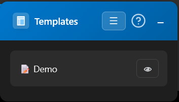
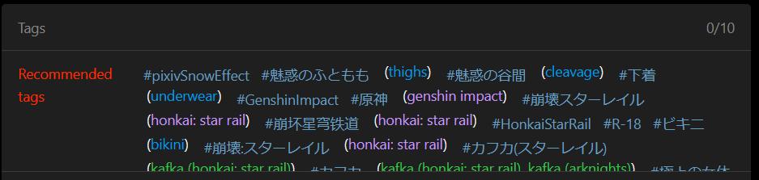

<p align="center">
  
</p>

<p align="center">
  
  
  
  
  
</p>

<p align="center">
  <a href="README.md">English</a> | 
  <a href="docs/README_PT.md">Português</a> | 
  <a href="docs/README_JP.md">日本語</a> | 
  <a href="docs/README_ZH-CN.md">中文</a>
</p>

> [!WARNING]
> **This is a development branch.** Do not use the files from this branch unless strictly necessary. Otherwise, use the production files in the [**main**](https://github.com/gabszap/pixiv-templater/tree/main) branch.

---

A browser extension to automate the illustration upload process on Pixiv. Save templates with titles, captions, tags, and settings, and apply them with a single click. It also automatically translates Japanese tags to Danbooru tags.

## 📌 Table of Contents
- [About the Project](#about-the-project)
- [Why I Created This?](#why-i-created-this)
- [Showcase](#showcase)
- [Features](#features)
- [Installation](#installation)
- [Keyboard Shortcuts](#keyboard-shortcuts)
- [Development](#development)

## About the Project

**Pixiv Templater** is a browser extension designed to streamline the routine of artists who frequently post on Pixiv. Instead of dealing with manual and repetitive data entry or relying on external notes for copy-pasting, the tool allows you to save complete templates and apply them instantly, ensuring speed and consistency in every post.

## Why I Created This?

The idea came from my own frustration with the Pixiv upload process. Since the site doesn't offer templates, I had to keep my descriptions pinned to my Windows clipboard and manually paste them for every post. Additionally, wasting time researching the meaning of every suggested Japanese tag made the process exhausting. I decided to build this extension to turn this manual labor into a one-click task, letting artists focus on what really matters: posting their art and moving on.

## Showcase

<details>
  <summary>Click to view screenshots</summary>

  ### Video Demonstration
  Watch the extension in action.

  

  ### Dashboard
  Manage your templates and settings.
  

  ### Panel
  Floating panel on the upload page.

  

  ### Tag Translation
  Automated translations.

  

</details>

## Features

### Templates
- 📝 Save templates with title, caption, tags, age rating, and AI-generated status.
- 🔄 Apply templates with one click or via keyboard shortcuts.
- 📂 Export and import templates (JSON) for backup or sharing.

### Tag Translation
- 🏷️ Automatically translates Japanese tags on the upload page to Danbooru tags.
- 🎨 Color-coded by category (artist, character, copyright, general, meta).

### Ease of Use
- ⚡ Floating panel that can be minimized.
- ⌨️ Fully customizable keyboard shortcuts.
- 🌙 Native Dark Mode support.

## Installation

### Firefox & Firefox-based browsers
1. Download the latest `.xpi` file from the [Releases](https://github.com/gabszap/pixiv-templater/releases) page.
2. Open Firefox and type `about:addons` in the address bar.
3. Click the gear icon and select **"Install Add-on From File..."**.
4. Select the downloaded `.xpi` file.

### Chrome & Chrome-based browsers
1. Download the `.zip` file from the [Releases](https://github.com/gabszap/pixiv-templater/releases) page.
2. Extract the contents of the `.zip` file into a folder.
3. Go to `chrome://extensions/`.
4. Enable **"Developer mode"** in the top right corner.
5. Click **"Load unpacked"** and select the extracted folder.

> [!IMPORTANT]
> **Note:** Currently, only Firefox supports automatic updates. For Chromium-based browsers, automatic updates are not yet available for manual installations. Please check the [Releases](https://github.com/gabszap/pixiv-templater/releases) page periodically to ensure you have the latest version.

## Keyboard Shortcuts

| Action | Default Shortcut |
|------|---------------|
| Open/Close Panel | `Alt+Shift+T` |
| Minimize Panel | `Alt+Shift+M` |
| New Template | `Alt+Shift+N` |
| Apply Template 1-9 | `Alt+1` to `Alt+9` |

## Development

### Prerequisites
- [Node.js](https://nodejs.org/) (v18+)
- [web-ext](https://github.com/mozilla/web-ext) (installed via npm)

### Setup
```bash
# Clone the repository
git clone https://github.com/gabszap/pixiv-templater.git
cd pixiv-templater

# Install dependencies
npm install
```

### Build Commands
```bash
# Lint the extension
npm run lint

# Build for Firefox
npm run build-firefox

# Build for Chrome
npm run build-chrome

# Build both
npm run build
```

### Loading the Extension

**Firefox:**
1. Go to `about:debugging#/runtime/this-firefox`
2. Click "Load Temporary Add-on"
3. Select any file in the project folder

**Chrome:**
1. Go to `chrome://extensions/`
2. Enable "Developer mode"
3. Click "Load unpacked"
4. Select the project folder (or `artifacts/pixiv-templater-chrome/` after build)

## Contributing

Any contributions are greatly appreciated.

1. **Fork** the project
2. Create a **Branch** for your Feature (`git checkout -b feature/AmazingFeature`)
3. **Commit** your changes (`git commit -m 'Add some AmazingFeature'`)
4. **Push** to the Branch (`git push origin feature/AmazingFeature`)
5. Open a **Pull Request**

If you find a bug or have a suggestion, feel free to open an [Issue](https://github.com/gabszap/pixiv-templater/issues).

Want to add translations for another language? Feel free to submit a Pull Request.

<details>
  <summary>How to add new languages</summary>
If you want to contribute by adding a new language to the extension, follow these quick steps:

1. **Create the locale file**: Go to `locales/` and create a new JSON file named after the [language code](https://developer.chrome.com/docs/extensions/reference/api/i18n#locales) (e.g., `fr.json` for French). You can use `en.json` as a base.
2. **Register the language**: Open `locales/languages.json` and add your language code and its display name to the list:
   ```json
   "fr": "Français"
   ```
3. **Translate**: Fill the new JSON file with the translated strings.

That's it! The extension will automatically detect the new language and show it in the settings menu. Feel free to submit a Pull Request with your translation!

</details>

## Credits

- Tag translation based on [translate-pixiv-tags](https://github.com/evazion/translate-pixiv-tags) by evazion.
- Tag API: [Danbooru](https://danbooru.donmai.us).

## License

MIT License - see [LICENSE](LICENSE)