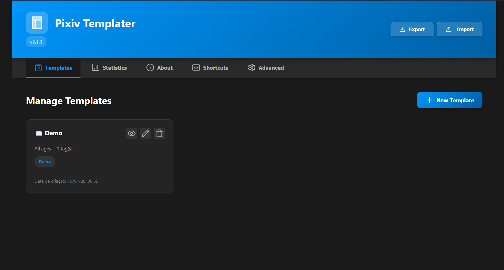

<p align="center">
  
</p>

<p align="center">
  
  
  
  
  
</p>

<p align="center">
  <a href="../../README.md">English</a> | 
  <a href="README_PT.md">Português</a> | 
  <a href="README_JP.md">日本語</a> | 
  <a href="README_ZH-CN.md">中文</a>
</p>

> [!WARNING]
> このドキュメントはAIによって翻訳されており、不正確な表現が含まれている可能性があります。
> (This document was translated by AI and may contain inaccuracies.)
---

Pixivでのイラスト投稿プロセスを自動化するためのブラウザ拡張機能です。タイトル、キャプション、タグ、設定をテンプレートとして保存し、ワンクリックで適用できます。また、日本語のタグをDanbooruのタグに自動的に翻訳します。

## 📌 目次
- [プロジェクトについて](#プロジェクトについて)
- [開発の動機](#開発の動機)
- [ショーケース](#ショーケース)
- [機能](#機能)
- [インストール](#インストール)
- [キーボードショートカット](#キーボードショートカット)

## プロジェクトについて

**Pixiv Templater** は、Pixivに頻繁に投稿し、同じ情報を繰り返し入力する必要がある絵師のルーチンを効率化するために設計されたブラウザ拡張機能です。手動で入力したり、外部のメモからコピー＆ペーストしたりする代わりに、テンプレートを保存して即座に適用でき、投稿のスピードと一貫性を確保できます。

## 開発の動機

このアイデアは、私自身のPixivへの投稿プロセスに対する不満から生まれました。サイトにテンプレート機能がないため、説明文をWindowsのクリップボードに固定し、投稿のたびに手動で貼り付ける必要がありました。さらに、推奨される日本語タグの意味を一つずつ調べるのに時間を費やすのは非常に疲れる作業でした。この手作業をワンクリックで済むようにし、絵師が本当に重要なこと（絵を描いて公開すること）に集中できるようにするために、この拡張機能を開発しました。

## ショーケース

<details>
  <summary>クリックしてスクリーンショットを表示</summary>

  ### ビデオデモンストレーション
  拡張機能の動作をご覧ください。

  

  ### ダッシュボード
  テンプレートと設定を管理します。
  

  ### パネル
  投稿ページのフローティングパネル。

  

  ### タグ翻訳
  自動翻訳機能。

  

</details>

## 機能

### テンプレート
- 📝 タイトル、キャプション、タグ、年齢制限、AI生成設定を保存。
- 🔄 ワンクリックまたはショートカットキーでテンプレートを適用。
- 📂 バックアップや共有のためのテンプレート出力・入力（JSON）。

### タグ翻訳
- 🏷️ 投稿ページの日本語タグをDanbooruタグに自動翻訳。
- 🎨 カテゴリ（絵師、キャラ、版権、一般、メタ）ごとに色分け。

### 使いやすさ
- ⚡ 最小化可能なフローティングパネル。
- ⌨️ 完全にカスタマイズ可能なキーボードショートカット。
- 🌙 ネイティブのダークモード対応。

## インストール

### Firefox & Firefoxベースのブラウザ
1. [Releases](https://github.com/gabszap/pixiv-templater/releases) ページから最新の `.xpi` ファイルをダウンロードします。
2. Firefoxを開き、アドレスバーに `about:addons` と入力します。
3. 歯車アイコンをクリックし、**「ファイルからアドオンをインストール...」** を選択します。
4. ダウンロードした `.xpi` ファイルを選択します。

### Chrome & Chromeベースのブラウザ
1. [Releases](https://github.com/gabszap/pixiv-templater/releases) ページから `.zip` ファイルをダウンロードします。
2. `chrome://extensions/` を開きます。
3. 右上の **「デベロッパーモード」** を有効にします。
4. **「パッケージ化されていない拡張機能を読み込む」** をクリックし、ダウンロードして解凍した `.zip` フォルダを選択します。

> [!IMPORTANT]
> **注意:** 現在、自動アップデートをサポートしているのは Firefox のみです。Chromiumベースのブラウザでの手動インストールでは、自動アップデートはまだ利用できません。最新バージョンを使用しているか確認するため、定期的に [Releases](https://github.com/gabszap/pixiv-templater/releases) ページをチェックしてください。

## キーボードショートカット

| アクション | デフォルト設定 |
|------|---------------|
| パネルを開く/閉じる | `Alt+Shift+T` |
| パネルを最小化 | `Alt+Shift+M` |
| 新規テンプレート | `Alt+Shift+N` |
| テンプレート1-9を適用 | `Alt+1` ～ `Alt+9` |

## 🤝 貢献 (Contributing)

あらゆる貢献を歓迎します。

1. プロジェクトを **Fork** する
2. 機能追加用 **Branch** を作成 (`git checkout -b feature/AmazingFeature`)
3. 変更を **Commit** する (`git commit -m 'Add some AmazingFeature'`)
4. Branchへ **Push** する (`git push origin feature/AmazingFeature`)
5. **Pull Request** を作成

バグを見つけた場合や提案がある場合は、お気軽に [Issue](https://github.com/gabszap/pixiv-templater/issues) を作成してください。

他の言語の翻訳を追加したいですか？プルリクエストをお待ちしています。

<details>
  <summary>新しい言語を追加する方法</summary>
新しい言語の追加で貢献したい場合は、以下の手順に従ってください：

1. **ロケールファイルの作成**: `pixiv-templater/locales/` に移動し、[言語コード](https://developer.chrome.com/docs/extensions/reference/api/i18n#locales)に基づいた新しいJSONファイルを作成します（例：フランス語なら `fr.json`）。`en.json` をベースとして使用できます。
2. **言語の登録**: `pixiv-templater/locales/languages.json` を開き、言語コードと表示名をリストに追加します：
   ```json
   "fr": "Français"
   ```
3. **翻訳**: 新しいJSONファイルに翻訳済みの文字列を入力します。

これだけで完了です！拡張機能は自動的に新しい言語を検出し、設定メニューに表示します。翻訳のプルリクエストをお待ちしています！

</details>

## クレジット

- タグ翻訳: [translate-pixiv-tags](https://github.com/evazion/translate-pixiv-tags) (by evazion)
- タグAPI: [Danbooru](https://danbooru.donmai.us)

## ライセンス

MIT License - [LICENSE](../../LICENSE) を参照してください。
